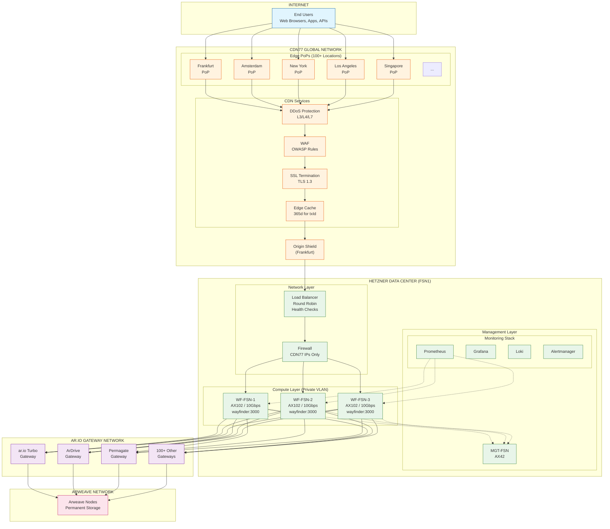
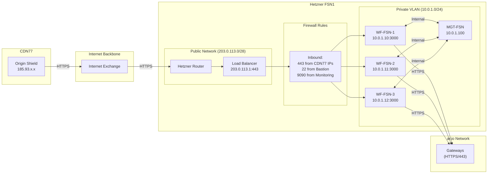
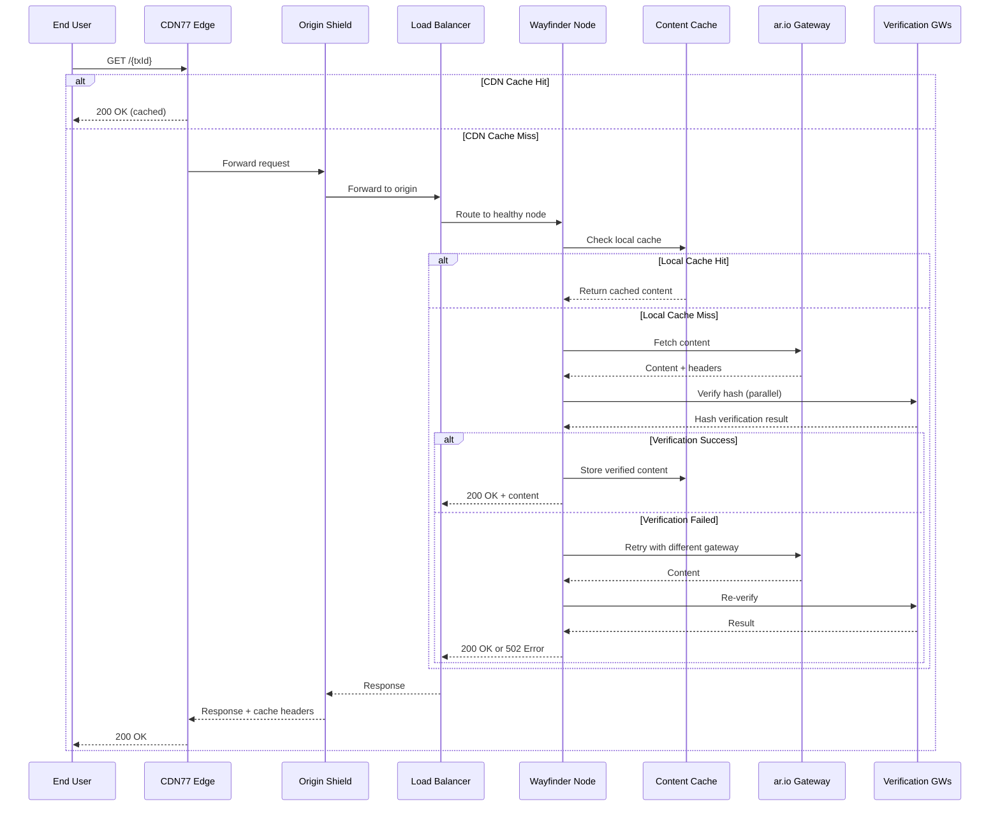
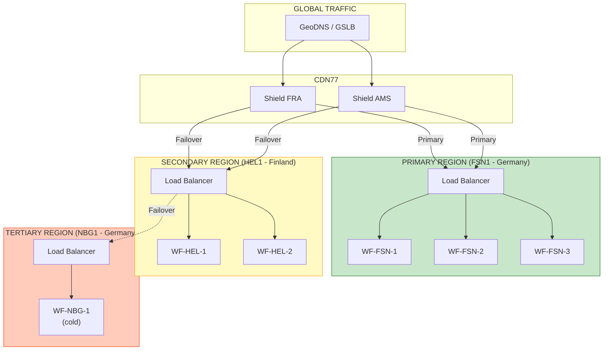
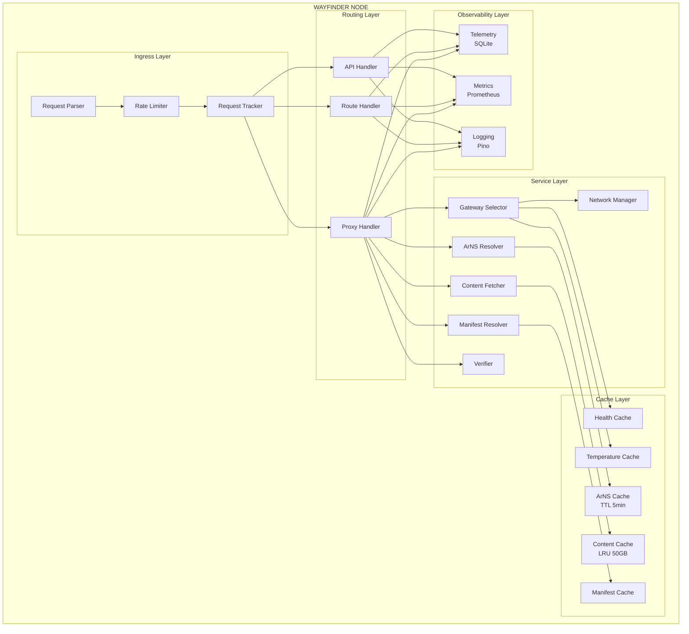

# Wayfinder Router Enterprise Deployment Diagram

## Overview

This document provides visual representations of the enterprise deployment architecture for Wayfinder Router on Hetzner bare metal with CDN77.

---

## 1. High-Level Architecture (Mermaid)



---

## 2. Detailed Network Topology (Mermaid)



---

## 3. Request Flow Diagram (Mermaid)



---

## 4. Multi-Region DR Architecture (Mermaid)



---

## 5. Component Architecture (Mermaid)



---

## 6. ASCII Deployment Diagram

For environments where Mermaid is not supported:

```
                                    INTERNET USERS
                                          │
                                          ▼
    ┌─────────────────────────────────────────────────────────────────────────┐
    │                           CDN77 GLOBAL NETWORK                           │
    │                                                                          │
    │   ┌─────────┐ ┌─────────┐ ┌─────────┐ ┌─────────┐ ┌─────────┐          │
    │   │   FRA   │ │   AMS   │ │   NYC   │ │   LAX   │ │   SG    │  ...     │
    │   │   PoP   │ │   PoP   │ │   PoP   │ │   PoP   │ │   PoP   │          │
    │   └────┬────┘ └────┬────┘ └────┬────┘ └────┬────┘ └────┬────┘          │
    │        └───────────┴───────────┴───────────┴───────────┘               │
    │                                │                                        │
    │   ┌────────────────────────────┼────────────────────────────┐          │
    │   │     ┌──────────┐    ┌──────┴─────┐    ┌──────────┐      │          │
    │   │     │   DDoS   │───▶│    WAF     │───▶│   SSL    │      │          │
    │   │     │Protection│    │  (OWASP)   │    │  (TLS)   │      │          │
    │   │     └──────────┘    └────────────┘    └──────────┘      │          │
    │   └────────────────────────────┬────────────────────────────┘          │
    │                                │                                        │
    │                    ┌───────────┴───────────┐                            │
    │                    │    ORIGIN SHIELD      │                            │
    │                    │     (Frankfurt)       │                            │
    │                    └───────────┬───────────┘                            │
    └────────────────────────────────┼────────────────────────────────────────┘
                                     │
                                     │ HTTPS (CDN77 IPs only)
                                     ▼
    ┌─────────────────────────────────────────────────────────────────────────┐
    │                    HETZNER FSN1 DATA CENTER                              │
    │                                                                          │
    │  ┌─────────────────────────────────────────────────────────────────┐    │
    │  │                      NETWORK LAYER                               │    │
    │  │  ┌─────────────────────────────────────────────────────────┐    │    │
    │  │  │              LOAD BALANCER (Round Robin)                 │    │    │
    │  │  │                  203.0.113.1:443                         │    │    │
    │  │  │              Health: /wayfinder/ready                    │    │    │
    │  │  └──────────────────────────┬──────────────────────────────┘    │    │
    │  │                             │                                   │    │
    │  │  ┌──────────────────────────┴──────────────────────────────┐    │    │
    │  │  │                    FIREWALL                              │    │    │
    │  │  │         Allow: CDN77 IPs → 443, Bastion → 22            │    │    │
    │  │  └──────────────────────────┬──────────────────────────────┘    │    │
    │  └─────────────────────────────┼───────────────────────────────────┘    │
    │                                │                                         │
    │  ┌─────────────────────────────┼───────────────────────────────────┐    │
    │  │              PRIVATE VLAN (10.0.1.0/24)                          │    │
    │  │                             │                                    │    │
    │  │         ┌───────────────────┼───────────────────┐               │    │
    │  │         │                   │                   │               │    │
    │  │         ▼                   ▼                   ▼               │    │
    │  │  ┌─────────────┐    ┌─────────────┐    ┌─────────────┐         │    │
    │  │  │  WF-FSN-1   │    │  WF-FSN-2   │    │  WF-FSN-3   │         │    │
    │  │  │             │    │             │    │             │         │    │
    │  │  │  AX102      │    │  AX102      │    │  AX102      │         │    │
    │  │  │  48C/256GB  │    │  48C/256GB  │    │  48C/256GB  │         │    │
    │  │  │  10 Gbps    │    │  10 Gbps    │    │  10 Gbps    │         │    │
    │  │  │             │    │             │    │             │         │    │
    │  │  │ ┌─────────┐ │    │ ┌─────────┐ │    │ ┌─────────┐ │         │    │
    │  │  │ │Wayfinder│ │    │ │Wayfinder│ │    │ │Wayfinder│ │         │    │
    │  │  │ │ :3000   │ │    │ │ :3000   │ │    │ │ :3000   │ │         │    │
    │  │  │ └─────────┘ │    │ └─────────┘ │    │ └─────────┘ │         │    │
    │  │  │ ┌─────────┐ │    │ ┌─────────┐ │    │ ┌─────────┐ │         │    │
    │  │  │ │ Cache   │ │    │ │ Cache   │ │    │ │ Cache   │ │         │    │
    │  │  │ │  50GB   │ │    │ │  50GB   │ │    │ │  50GB   │ │         │    │
    │  │  │ └─────────┘ │    │ └─────────┘ │    │ └─────────┘ │         │    │
    │  │  │ 10.0.1.10   │    │ 10.0.1.11   │    │ 10.0.1.12   │         │    │
    │  │  └──────┬──────┘    └──────┬──────┘    └──────┬──────┘         │    │
    │  │         │                  │                  │                │    │
    │  │         └──────────────────┴──────────────────┘                │    │
    │  │                            │                                   │    │
    │  │                    ┌───────┴───────┐                           │    │
    │  │                    │   MGT-FSN     │                           │    │
    │  │                    │   10.0.1.100  │                           │    │
    │  │                    │               │                           │    │
    │  │                    │ ┌───────────┐ │                           │    │
    │  │                    │ │Prometheus │ │                           │    │
    │  │                    │ │ Grafana   │ │                           │    │
    │  │                    │ │ Loki      │ │                           │    │
    │  │                    │ │Alertmanager│                            │    │
    │  │                    │ └───────────┘ │                           │    │
    │  │                    └───────────────┘                           │    │
    │  └─────────────────────────────────────────────────────────────────┘    │
    └─────────────────────────────────────────────────────────────────────────┘
                                     │
                                     │ HTTPS (to gateways)
                                     ▼
    ┌─────────────────────────────────────────────────────────────────────────┐
    │                        AR.IO GATEWAY NETWORK                             │
    │                                                                          │
    │  ┌─────────────┐  ┌─────────────┐  ┌─────────────┐  ┌─────────────┐     │
    │  │   ar.io     │  │   ArDrive   │  │  Permagate  │  │   100+      │     │
    │  │   Turbo     │  │   Gateway   │  │   Gateway   │  │   Others    │     │
    │  │  (Routing)  │  │  (Routing)  │  │ (Routing)   │  │ (Routing)   │     │
    │  │ (Verify)    │  │  (Verify)   │  │  (Verify)   │  │             │     │
    │  └─────────────┘  └─────────────┘  └─────────────┘  └─────────────┘     │
    │                                                                          │
    └────────────────────────────────┬────────────────────────────────────────┘
                                     │
                                     ▼
    ┌─────────────────────────────────────────────────────────────────────────┐
    │                          ARWEAVE NETWORK                                 │
    │                                                                          │
    │                    ┌───────────────────────────┐                         │
    │                    │    PERMANENT STORAGE      │                         │
    │                    │    (Immutable Data)       │                         │
    │                    │                           │                         │
    │                    │  Transactions (txId)      │                         │
    │                    │  Manifests                │                         │
    │                    │  ArNS Records             │                         │
    │                    └───────────────────────────┘                         │
    │                                                                          │
    └─────────────────────────────────────────────────────────────────────────┘


    ═══════════════════════════════════════════════════════════════════════════
                                    LEGEND
    ═══════════════════════════════════════════════════════════════════════════

    Traffic Flow:
    ─────────────
    User Request:  Internet → CDN77 Edge → Origin Shield → Hetzner LB → Node
    Content Fetch: Node → ar.io Gateway → Arweave Network
    Verification:  Node → Multiple Verification Gateways (parallel)

    Security Layers:
    ────────────────
    Layer 1: CDN77 DDoS Protection (L3/L4/L7)
    Layer 2: CDN77 WAF (OWASP rules)
    Layer 3: TLS Encryption (TLS 1.3)
    Layer 4: Hetzner Firewall (IP allowlist)
    Layer 5: Application Rate Limiting
    Layer 6: Content Hash Verification

    Cache Layers:
    ─────────────
    Layer 1: CDN77 Edge Cache (365d for txId content)
    Layer 2: Origin Shield Cache
    Layer 3: Node Content Cache (50GB LRU per node)
    Layer 4: Node ArNS/Manifest Cache (TTL-based)

    High Availability:
    ──────────────────
    • 3 nodes in active/active configuration
    • N+1 redundancy (can lose 1 node)
    • Load balancer health checks (5s interval)
    • Circuit breaker for gateway failures
    • Graceful shutdown with request draining

    Monitoring:
    ───────────
    • Prometheus metrics scraping (/wayfinder/metrics)
    • Grafana dashboards
    • Loki log aggregation
    • Alertmanager → PagerDuty integration
```

---

## 7. Data Flow Matrix

| Source | Destination | Protocol | Port | Purpose |
|--------|-------------|----------|------|---------|
| Users | CDN77 Edge | HTTPS | 443 | Client requests |
| CDN77 Edge | Origin Shield | HTTPS | 443 | Cache miss |
| Origin Shield | Hetzner LB | HTTPS | 443 | Origin pull |
| Hetzner LB | Wayfinder Nodes | HTTP | 3000 | Load balancing |
| Wayfinder Nodes | ar.io Gateways | HTTPS | 443 | Content fetch |
| Wayfinder Nodes | Verification GWs | HTTPS | 443 | Hash verification |
| Prometheus | Wayfinder Nodes | HTTP | 3000 | Metrics scrape |
| Wayfinder Nodes | Management | Various | Various | Logs, internal |
| Bastion | All Servers | SSH | 22 | Administration |

---

## 8. Port Reference

| Service | Port | Protocol | Exposure |
|---------|------|----------|----------|
| Wayfinder App | 3000 | HTTP | Internal only |
| Prometheus | 9090 | HTTP | Internal only |
| Grafana | 3001 | HTTP | VPN/Internal |
| Loki | 3100 | HTTP | Internal only |
| Alertmanager | 9093 | HTTP | Internal only |
| Node Exporter | 9100 | HTTP | Internal only |
| SSH | 22 | TCP | Bastion only |
| Load Balancer | 443 | HTTPS | CDN77 IPs only |

---

## 9. Rendering Options

This diagram can be rendered using:

1. **GitHub/GitLab**: Native Mermaid support in markdown files
2. **VS Code**: Install "Markdown Preview Mermaid Support" extension
3. **Mermaid Live Editor**: https://mermaid.live
4. **Obsidian**: Native Mermaid support
5. **Notion**: Mermaid code blocks
6. **Confluence**: Mermaid plugin
7. **PlantUML**: Convert to PlantUML syntax if needed
8. **Draw.io**: Import Mermaid or recreate manually

For professional documentation, export from Mermaid Live Editor to:
- PNG (for documents)
- SVG (for web/scalable)
- PDF (for presentations)

---

## 10. Alternative Diagram Formats

### 10.1 PlantUML Version

If you prefer PlantUML, the deployment can be represented as:

```plantuml
@startuml
!include <cloudinsight/common>
!include <cloudinsight/web_server>

cloud "Internet" {
  actor Users
}

cloud "CDN77" {
  node "Edge PoPs" as edge
  node "Origin Shield" as shield
}

frame "Hetzner FSN1" {
  node "Load Balancer" as lb

  frame "Private VLAN" {
    node "WF-FSN-1" as wf1
    node "WF-FSN-2" as wf2
    node "WF-FSN-3" as wf3
    node "Management" as mgt
  }
}

cloud "ar.io Network" {
  node "Gateways" as gw
}

cloud "Arweave" {
  database "Permanent Storage" as ar
}

Users --> edge
edge --> shield
shield --> lb
lb --> wf1
lb --> wf2
lb --> wf3
wf1 --> gw
wf2 --> gw
wf3 --> gw
gw --> ar
wf1 ..> mgt
wf2 ..> mgt
wf3 ..> mgt

@enduml
```

### 10.2 Draw.io XML

For Draw.io, import the Mermaid diagram or create manually using the ASCII diagram as reference.

---

*Diagrams last updated: 2026-01-27*
